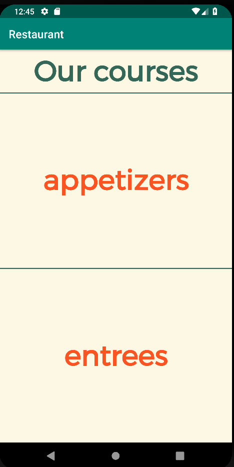
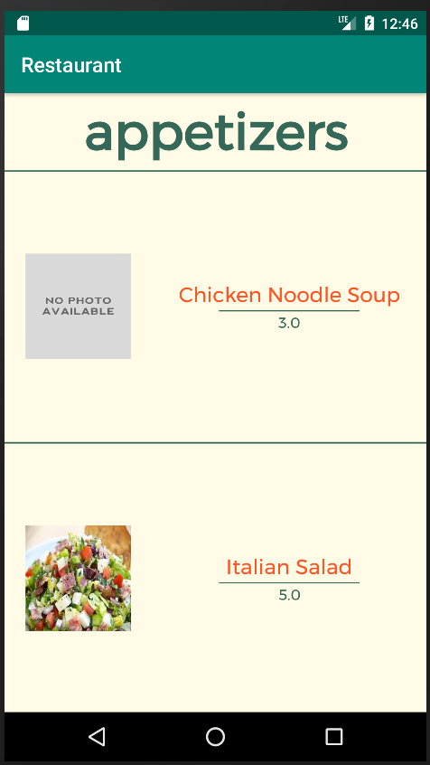
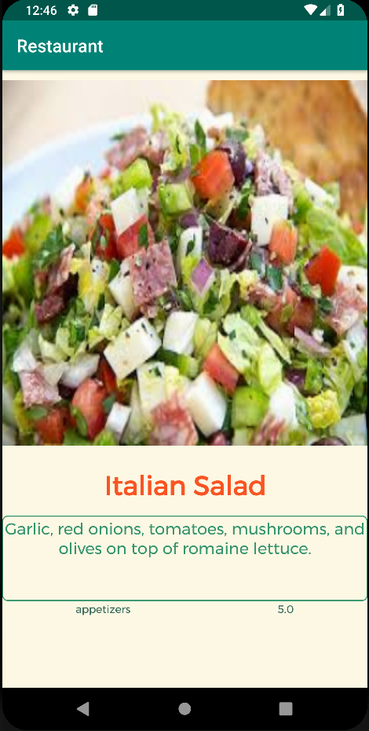
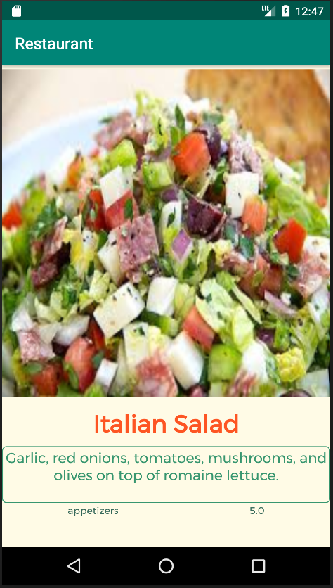
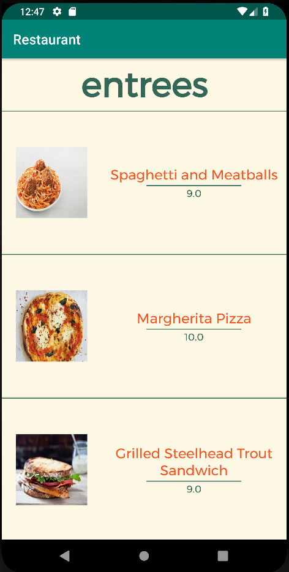

Hoi, dit is mijn Restaurant app. Ik heb extra aandacht besteed aan het compatible maken van meerdere
groote telefoons. De screenshots zijn afwisselend van een pixel 2 XL (6.0Inch, 1440 x 2880) 
en een nexus 5 (5.2 inches, 1080 x 1920).\\

Waar ik ook aandacht aan heb besteed is dat in het scherm waar de menus items op staan 
(als je dus op entrees klikt bijvoorbeeld) het scherm altijd gevuld is. Als er minder dan 3 items
zijn waar je uit kan kiezen zullen die het hele scherm vullen (bij appetizers kan je dat zien),
als er meer dan 2 items zijn zullen er drie te zien zijn die het scherm vullen.

    

